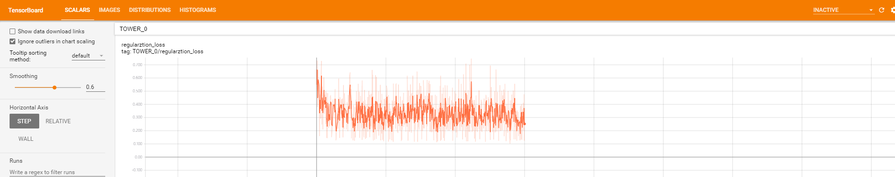
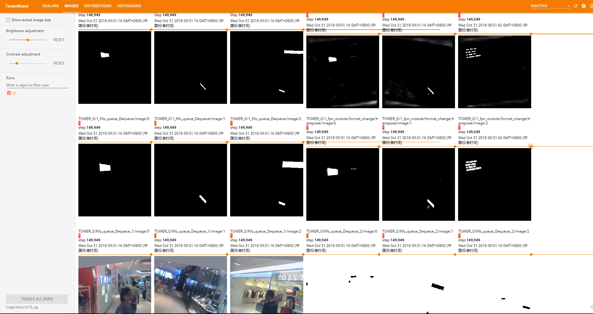

# Shape Robust Text Detection with Progressive Scale Expansion Networkt

A reimplement of PSENet with tensorflow. Only trained on IC15,TD500,and CTW1500. The preformence is low compared to paper's result. Maybe because of partial data training  (For each dataset I don't use extra data, but the paper use MLT data), or just maybe because of some bug in this code.

- The **pse algrithm** is implemented with **C++** and warped by cython in floder in `./PSE_C`
- Support simple hype-parameter search for test(such as threshold)
- Support checkpoint restore.
- summary logging by tensorboard  

Thanks for the author's (@whai362) great work!

## Prerequisites
- tensorflow = 1.8
- pudb(for debug)
- pyclipper(to clip polygon)
- skimage

## Result(Train only with the corresponding dataset, no extra data)
| Dataset | precision | recall | F-measure (%) |
| ------- | --------- | ------ | ------------- |
| ICDAR15 | 84.5      | 77.3   | 80.7          |
| TD500   | -         | -      | 80.2          |
| CTW1500 | -         | -      | 76            |

`-` this model had been removed in my server, so I forget exact f-measure, just for reference


## Training
1. Chage to dataset to tfrecord for high performence reading. This converter support IC15,TD500,CTW1500. Default for IC15. And change ***dataset_dir*** path in `dataset_factory.py`.
   ```bash
    cd dataset
    python write_tfrecord.py --data-folder 'your path here'
   ```
2. To use `ImageNet` Pretrained model, download the model to `Logs/model` from [model](http://download.tensorflow.org/models/official/20181001_resnet/checkpoints/resnet_imagenet_v1_fp32_20181001.tar.gz)
3. Train the model, you need edit `configuration.py` to adjust the patameter of trianing such as bactch size,learning rate.
   ```
   python train_PSENet.py --run_name test --restore=True --use_pretrain=True --gpus '0' --ss=10 --se=10 --about=''
   ```
4. you can monitor the progress of training by tensorboard
   ```
   tensorboard --host localhost --samples_per_plugin images=500 --port 7000 --logdir Logs/train/test
   ```
   
   


## Testing 
1. Compile the PSE code
    ```bash
    python setup.py build_ext --inplace
    ```
2. Edit test config in `configuration.py` such as ***threshold***, ***image size***, ***test_dir*** is the path of your test images.(such as `/you/path/icdar2015/ch4_test_images`)
   ```bash
   python eval_metric.py --ma=True --train_name test --gpus='2' --lg=False
   ```
3. If `lg` is `True`, you can view detect result in folder `Logs/test/<run_name>/model.ckpt-399999_0/image_log`
    
    
